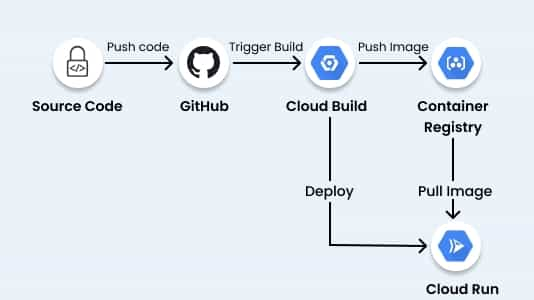

# Flask-Docker-App

## Set up & Installation.

### 1 .Clone/Fork the git repo  
                              
```
git clone https://github.com/Dev-Elie/Flask-Docker-App.git
```

### 2 . Build a Docker Images

```
docker build --tag python-docker .
```

### 3. Check the image 

```
docker images
```

### 4. Run the docker image

```
docker run -d -p 5000:5000 python-docker
```

# Deploy in the GCP Cloud Run.



* Using the cloudbuild.yaml configure the GCP Cloud build.

* Docker image will be saved in the GCP container Registry.

* Then the docker image will be deployed in the Cloud Run.